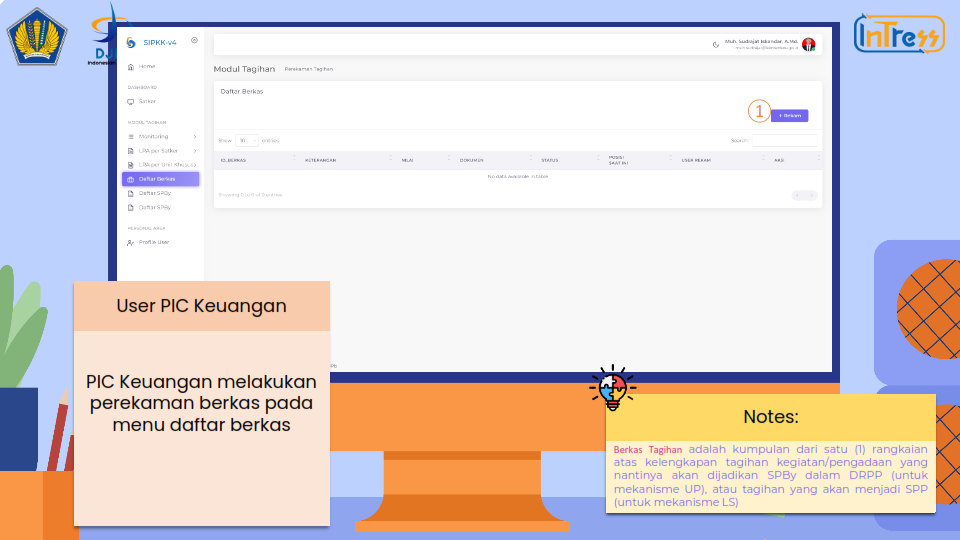
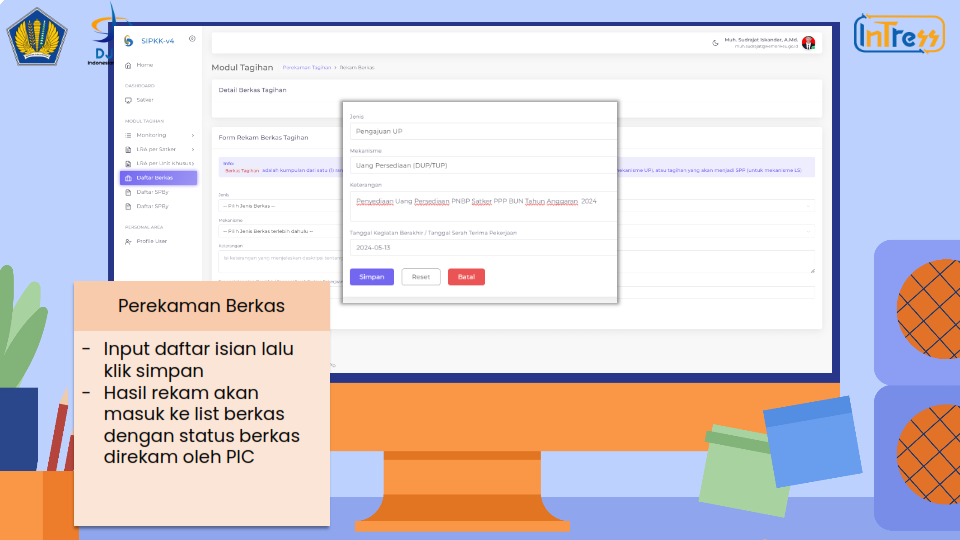
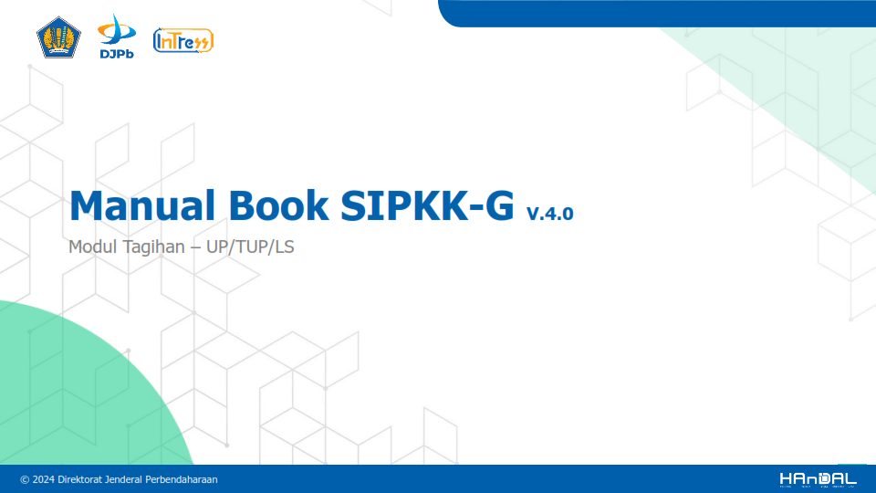
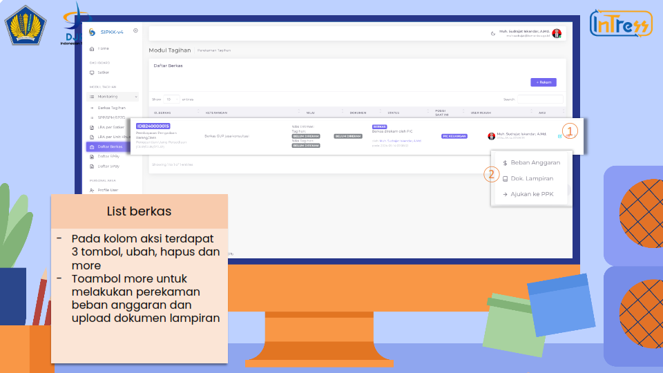
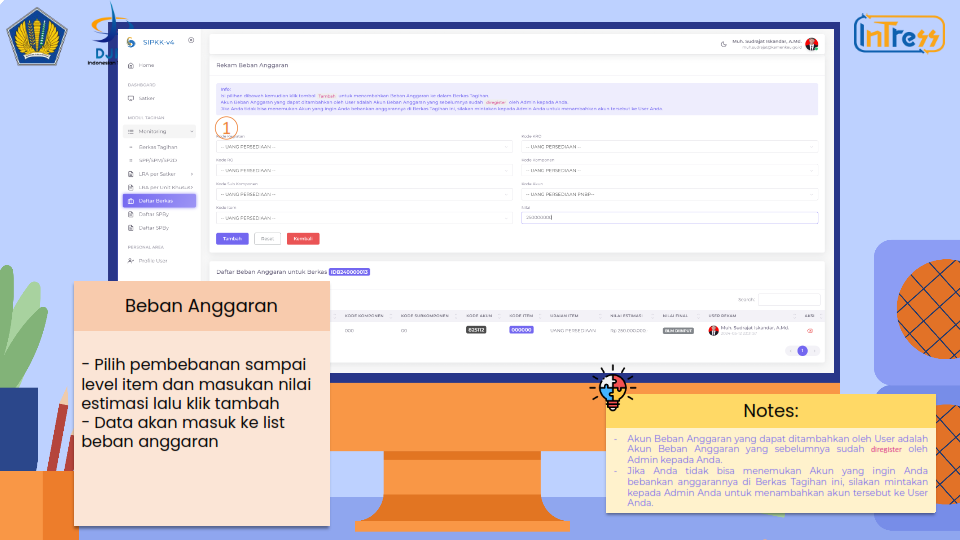
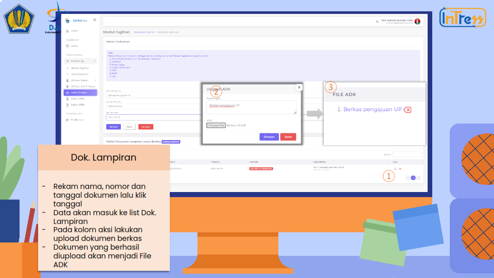

# Tagihan UP / TUP

## Perekaman Berkas

**Langkah 1**

PIC Keuangan melakukan perekaman berkas pada menu daftar berkas

**Langkah 2**
Input daftar isian lalu klik simpan, Hasil rekam akan masuk ke list berkas dengan status berkas direkam oleh PIC

**Langkah 3**
Pada kolom aksi terdapat 3 tombol, ubah, hapus dan more, Tombol more untuk melakukan perekaman beban anggaran dan upload dokumen lampiran

## Pembebanan Anggaran

**Langkah 4**
Pilih pembebanan sampai level item dan masukan nilai estimasi lalu klik tambah, Data akan masuk ke list beban anggaran

**Langkah 5**
Rekam nama, nomor dan tanggal dokumen lalu klik tanggal, Data akan masuk ke list Dok. Lampiran Pada kolom aksi lakukan upload dokumen berkas Dokumen yang berhasil diupload akan menjadi File ADK

**Langkah 6**
Jika beban anggaran dan dokumen lampiran sudah direkam, selanjutnya mengirim berkas ke PPK

**Langkah 7**
